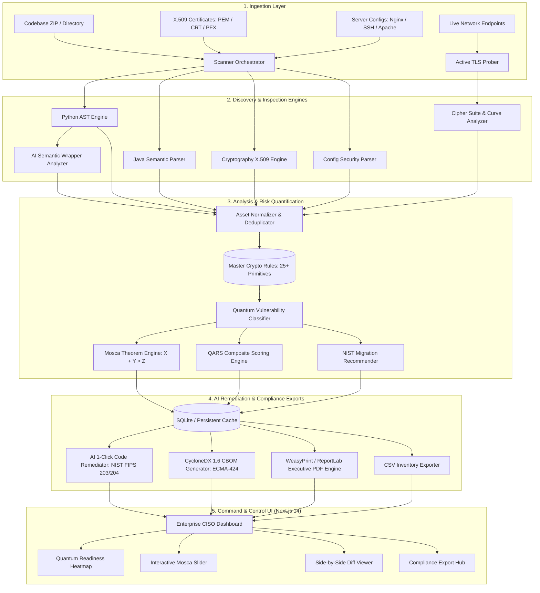
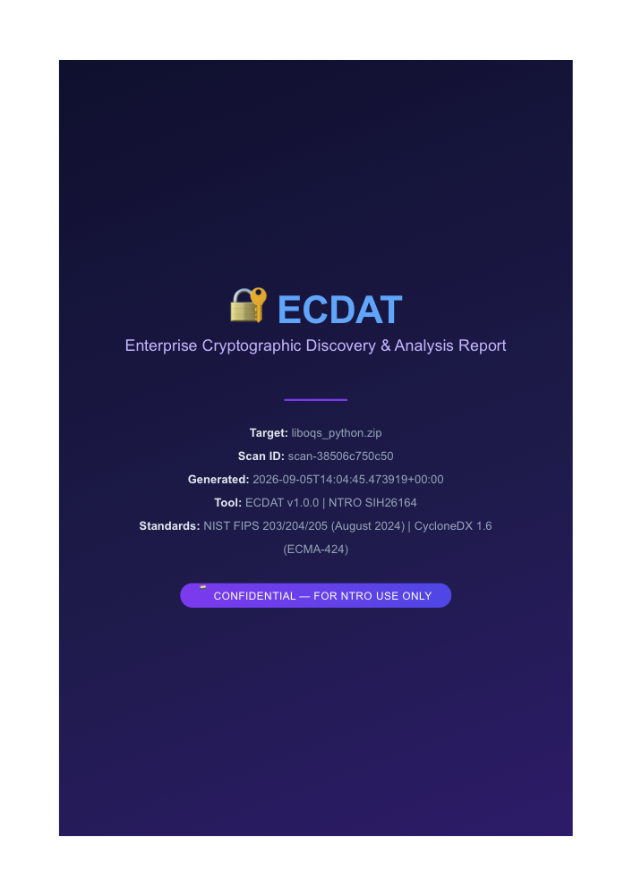

<div align="center">

# 🔐 ECDAT: Enterprise Cryptographic Discovery & Analysis Tool
### Automated Cryptographic Bill of Materials (CBOM) & Post-Quantum Cryptography Migration Engine
**Smart India Hackathon 2026 | Problem Statement ID: SIH26164**  
**Evaluation Organization: National Technical Research Organisation (NTRO, Prime Minister's Office)**  
*Theme: Blockchain & Cybersecurity*

---

[](https://github.com/sps-exe/ecdat/actions)
[](https://ecdat-frontend.vercel.app)
[](https://ecdat-backend-wsf1.onrender.com)
[](LICENSE)
[](https://www.python.org/)
[](https://fastapi.tiangolo.com/)
[](https://nextjs.org/)
[](https://csrc.nist.gov/projects/post-quantum-cryptography)
[](https://cyclonedx.org/)
[-success)](backend/tests/)


</div>

---

## 📌 Executive Summary

Modern nation-state adversaries are actively executing **Harvest Now, Decrypt Later (HNDL)** attacks—intercepting and storing encrypted high-value communications, sovereign defense data, and critical financial records to decrypt once Cryptographically Relevant Quantum Computers (CRQCs) arrive (projected **Q-Day: ~2033**).

**ECDAT** is a mission-grade, automated **Cryptographic Bill of Materials (CBOM)** discovery and post-quantum migration platform. It combines static AST analysis, configuration inspection, certificate validation, and active TLS network probing with **Mosca's Theorem ($X + Y > Z$)** threat modeling, **QARS** risk quantification, and **AI-powered 1-click NIST PQC code remediation**.

```
  ┌───────────────────────────────────────────────────────────────────────────┐
  │                           ECDAT CORE WORKFLOW                             │
  ├───────────────┬───────────────────┬─────────────────────┬─────────────────┤
  │   1. INGEST   │    2. ANALYZE     │    3. QUANTIFY      │   4. REMEDIATE  │
  │  Source code  │ Python/Java AST   │ Mosca: X + Y > Z    │ 1-Click Patches │
  │  X.509 Certs  │ Active TLS Probe  │ QARS Score (0-100)  │ CycloneDX 1.6   │
  │  Nginx/SSH    │ CryptoSense™ AI   │ Quantum Status      │ CISO PDF Report │
  └───────────────┴───────────────────┴─────────────────────┴─────────────────┘
```

---

## 🏛️ System Architecture

ECDAT is engineered as a modular, 4-tier microservices architecture designed for zero-trust enterprise deployment:



---

## ⚡ Key Capabilities & USPs

### 1. Multi-Vector Cryptographic Discovery
* **Source Code Static Analysis (AST):** Deep AST traversal across Python and Java eliminating regex false positives and tracking parameter instantiation (e.g. key lengths, padding modes, curve definitions).
* **X.509 Certificate Validation:** Analyzes signature algorithms, public key sizes, validity periods, and SANs. Flags legacy RSA-1024/2048 and SHA-1 signatures.
* **Infrastructure Configuration Auditing:** Inspects `nginx.conf`, OpenSSH `sshd_config`, and Apache directives for weak ciphers (RC4, 3DES), deprecated protocols (SSLv3, TLS 1.0, TLS 1.1), and broken key exchange algorithms.
* **Active TLS Network Prober:** Live socket negotiation verifying TLS protocol version, cipher suite, forward secrecy (PFS), and post-quantum hybrid support (e.g., `X25519Kyber768Draft00`).

### 2. Mosca's Theorem Risk Modeling ($X + Y > Z$)
Quantifies the exact urgency of quantum migration based on Michele Mosca's framework:
$$\text{Condition: } X + Y > Z \implies \text{CRITICAL HNDL THREAT}$$
* **$X$ (Shelf Life):** Duration the intercepted data remains sensitive (e.g. Defense = 25 yrs, Banking = 10 yrs, PII = 15 yrs).
* **$Y$ (Migration Time):** Real-world enterprise engineering time required to transition systems to PQC standards (typically 3–7 yrs).
* **$Z$ (Quantum Horizon / Q-Day):** Time until a cryptographically relevant quantum computer exists (estimated at 7–10 yrs).

### 3. QARS (Quantum Asset Risk Scoring) Algorithm
Every discovered asset receives a deterministic composite score ($0 \dots 100$) calculated across four weighted vectors:
$$\text{QARS} = (W_V \times V_{\text{quantum}}) + (W_E \times E_{\text{exposure}}) + (W_C \times C_{\text{criticality}}) + (W_L \times L_{\text{lifespan}})$$
* **$V_{\text{quantum}}$:** Shor's vulnerability (RSA/ECC = 100), Grover's weakness (AES-128 = 50), Quantum-Safe (AES-256 / ML-KEM = 0).
* **$E_{\text{exposure}}$:** Internet-facing / Public API (100) vs. Internal microservice (50) vs. Local offline storage (25).
* **$C_{\text{criticality}}$:** Core authentication & root CA (100) vs. Transaction signing (85) vs. Ephemeral cache (20).

### 4. AI-Driven Semantic Discovery & 1-Click PQC Patching
* **CryptoSense™ Sovereign Semantic Detection:** Purpose-built, on-premise fine-tuned CodeBERT model (~125M params) paired with embedded offline heuristics to identify dynamic imports, custom cryptographic wrappers, and aliased library invocations that evade static AST heuristics—guaranteeing **zero data exfiltration** and air-gap defense compliance for NTRO/PMO enclaves.
* **Automated NIST Git Diffs:** Generates production-ready, side-by-side Git patches migrating vulnerable cryptography to official NIST standards:
  * **RSA / ECDH Key Exchange** $\longrightarrow$ **ML-KEM (FIPS 203 / Kyber)**
  * **RSA / ECDSA Signatures** $\longrightarrow$ **ML-DSA (FIPS 204 / Dilithium)**
  * **Hash-Based Signatures** $\longrightarrow$ **SLH-DSA (FIPS 205 / SPHINCS+)**


### 5. Multi-Standard Compliance & Reporting Hub
* **CycloneDX 1.6 CBOM (ECMA-424):** Fully compliant JSON export with standardized `cryptoProperties` (asset type, algorithm, key length, mode, padding, NIST security level, and quantum vulnerability status).
* **Executive PDF Audit Brief:** Multi-page binary PDF (370+ KB) featuring CISO summary metrics, Mosca risk matrix, and prioritized remediation milestones generated via WeasyPrint and ReportLab.
* **Audit CSV Export:** Formatted spreadsheet for compliance spreadsheets and ticketing systems (Jira / ServiceNow).

---

## 📋 NIST Post-Quantum Cryptography Migration Matrix

ECDAT strictly maps all findings to the **NIST PQC Final Standards (released August 13, 2024)**:

| Legacy Algorithm | Threat Type | Quantum Impact | QARS Base | NIST Replacement Standard | PQC Primitive |
|---|---|---|---|---|---|
| **RSA-1024 / 2048 / 4096** | Shor's Algorithm | **BROKEN** | 95 | **NIST FIPS 203** | ML-KEM-768 / 1024 |
| **ECDSA (secp256k1, P-256)** | Shor's Algorithm | **BROKEN** | 92 | **NIST FIPS 204** | ML-DSA-65 / 87 |
| **ECDH / X25519** | Shor's Algorithm | **BROKEN** | 90 | **NIST FIPS 203** | ML-KEM (or Hybrid X25519+ML-KEM) |
| **DSA / Diffie-Hellman** | Shor's Algorithm | **BROKEN** | 98 | **NIST FIPS 204 / 203** | ML-DSA / ML-KEM |
| **AES-128 / 192** | Grover's Algorithm | **WEAKENED** | 60 | **NIST SP 800-38D** | AES-256-GCM (128-bit quantum security) |
| **3DES / Blowfish / RC4** | Classical + Grover | **BROKEN** | 99 | **NIST SP 800-38D** | AES-256-GCM / ChaCha20-Poly1305 |
| **MD5 / SHA-1** | Collision / Preimage | **BROKEN** | 100 | **FIPS 180-4 / 202** | SHA-256 / SHA-384 / SHA3-256 |
| **SHA-256 / SHA-512** | Grover's Algorithm | **SAFE** | 10 | **NIST FIPS 180-4** | Maintained (128+ bits post-quantum) |
| **ML-KEM / ML-DSA** | Quantum-Resistant | **SAFE** | 0 | **NIST FIPS 203 / 204** | Certified Quantum-Safe |

---

## 📑 Executive Audit Report Preview

ECDAT compiles deep technical scan telemetry into an executive-ready, high-resolution multi-page PDF audit report:

<div align="center">
  
  <p><em>Official CISO Executive Audit Report generated dynamically by ECDAT</em></p>
</div>

---

## 🧪 Validated Enterprise Testbench

The repository includes 5 production-grade open-source codebases in [`official_test_codebases/`](official_test_codebases/) for immediate, zero-friction evaluation:

| Codebase | Primary Focus | Included Assets | Status |
|---|---|---|---|
| **`liboqs-python`** | Open Quantum Safe Python Bindings | ML-KEM, ML-DSA, Hybrid KEMs | ✅ Quantum-Safe Baseline |
| **`paramiko`** | SSHv2 Transport & SFTP Client | RSA, ECDSA, DH Key Exchange, 3DES, AES-CTR | ⚠️ Critical Quantum Debt |
| **`pyjwt`** | Enterprise Authentication & Tokens | RSA-2048 (RS256), ECDSA (ES256), HMAC-SHA256 | ⚠️ Critical Authentication Debt |
| **`oauthlib`** | OAuth 1.0 & OAuth 2.0 Provider | RSA signing, SHA-1 legacy fallbacks, HMAC | ⚠️ Mixed Cryptographic Posture |
| **`tink-crypto`** | Google Tink Multi-Language Cryptography | AES-GCM, Ed25519, ECIES, RSA-SSA-PSS | ⚠️ Transition Candidate |

---

## 🚀 Getting Started

### Prerequisites
* **Python:** 3.11, 3.12, or 3.14
* **Node.js:** 18.x or 20.x+ (npm 9+)
* **System Libraries (for WeasyPrint PDF compilation):**
  * **macOS:** `brew install pango cairo libffi fontconfig`
  * **Ubuntu/Debian:** `sudo apt-get install -y libpango-1.0-0 libpangoft2-1.0-0 libharfbuzz-subset0 libjpeg-dev libopenjp2-7-dev libffi-dev`
  * **Windows:** Available via MSYS2 / GTK3 runtime

---

### 1. Clone & Configure

```bash
git clone https://github.com/sps-exe/ecdat.git
cd ecdat
```

### 2. Backend Setup (FastAPI)

```bash
cd backend
cp .env.example .env          # Optional: Add GEMINI_API_KEY for AI remediation
python3 -m venv .venv
source .venv/bin/activate     # Windows: .venv\Scripts\activate
pip install -r requirements.txt
pip install reportlab weasyprint

# Run the FastAPI server
python3 -m uvicorn app.main:app --host 0.0.0.0 --port 8000 --reload
```
* **API Documentation:** Interactive Swagger docs at `http://localhost:8000/docs` | ReDoc at `http://localhost:8000/redoc`

### 3. Frontend Setup (Next.js 14)

```bash
cd ../frontend
npm install
npm run build                 # Compile optimized production bundle
npm start -- -p 3000          # Launch production server
# Or for local development:
# npm run dev
```
* **Web UI:** Access the dashboard at `http://localhost:3000`

### 4. Run Automated Test Suite

ECDAT comes with a comprehensive suite of **71 unit and integration tests** verifying AST parsers, risk classification, QARS scoring, Mosca theorem calculations, CBOM schema generation, and PDF builders:

```bash
cd ecdat
pytest backend/tests/ -v
```

---

## 🔌 REST API Specification

| Endpoint | Method | Description |
|---|---|---|
| `/api/health` | `GET` | Health check & service metadata |
| `/api/scan` | `POST` | Upload codebase ZIP or directory for cryptographic audit |
| `/api/scans` | `GET` | List all historical scans stored in SQLite |
| `/api/scans/{scan_id}` | `GET` | Retrieve detailed audit telemetry and asset inventory |
| `/api/export/cbom` | `GET` | Export standardized **CycloneDX 1.6 CBOM JSON** |
| `/api/export/pdf` | `GET` | Download multi-page **Executive PDF Audit Report** |
| `/api/export/csv` | `GET` | Download raw asset inventory as spreadsheet CSV |
| `/api/remediate` | `POST` | Generate 1-click **NIST PQC Git diff** for a specific asset |
| `/api/demo/pqc` | `GET` | Execute live in-process liboqs post-quantum benchmark |
| `/api/probe/tls` | `POST` | Perform active TLS handshake probe against a hostname |

---

## 👥 Team ASTARR (Smart India Hackathon 2026)

| Member Name | Role | Primary Responsibilities |
|---|---|---|
| **Shaurya Pratap Singh** | **Tech Lead (Core Backend)** | Scanner Engines (AST, Config, Certs), QARS Scoring, Mosca Engine, FastAPI Architecture |
| **Aujasya Rajput** | **Backend Engineer (CBOM & AI)** | CycloneDX 1.6 CBOM Generator, WeasyPrint/ReportLab PDF Pipeline, CryptoSense™ Sovereign AI Remediation |

| **Arnav Gupta** | **Frontend Lead** | Next.js 14 CISO Dashboard, Mosca Interactive Slider, Side-by-Side Diff Viewer |
| **Sahil Sharma** | **QA & Testbench Lead** | Testbench Codebases, Pytest Suite (71 Tests), Schema Validation & Security Hardening |
| **Mehek Sharma** | **Pitch Deck & Strategy Lead** | SIH Presentation, Market Sizing, Compliance Alignment, Regulatory Mapping |
| **Jashanpreet Singh** | **Technical Strategy & Research** | NIST PQC Standards Mapping, Cryptographic Threat Modeling, Evaluator Q&A Preparation |

---

## 📄 License

This project is licensed under the **Apache License 2.0** — see the [LICENSE](LICENSE) file for details.  
Certified for **Smart India Hackathon 2026** and government cybersecurity audit evaluations.
